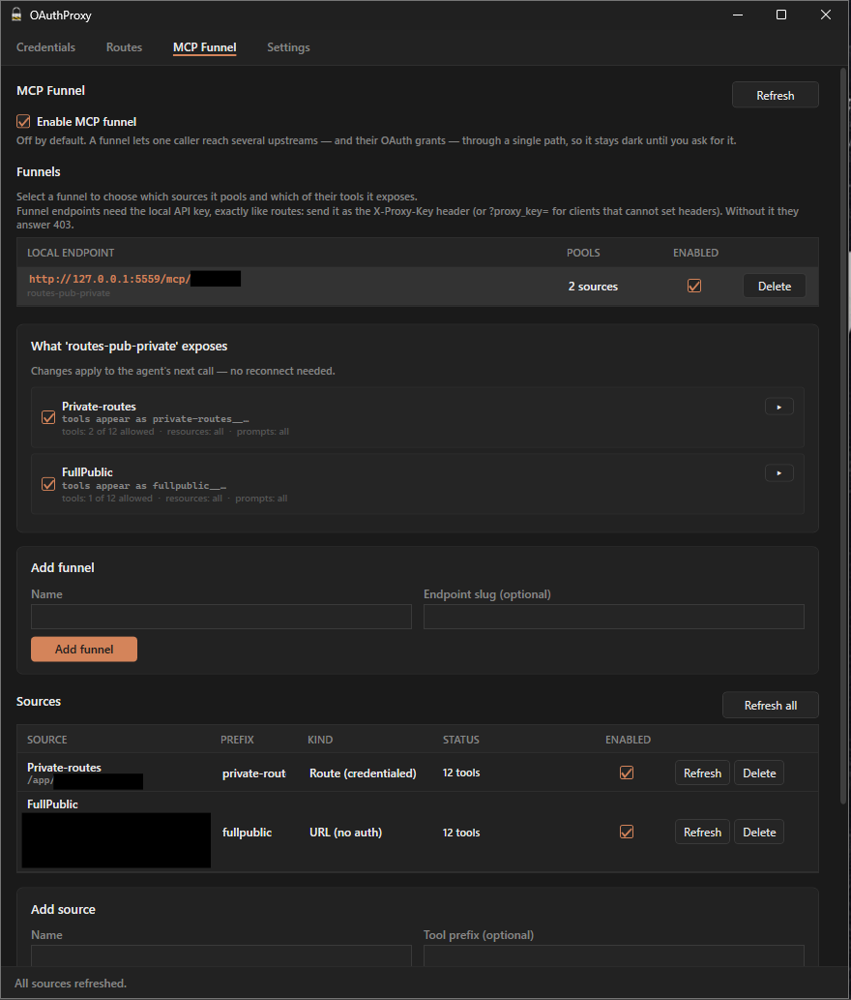

# OAuthProxy

**Give each AI agent its own MCP endpoint — pooling the servers you choose, exposing only the
tools you allow, with OAuth handled for you.**

A tray-resident Windows app that runs a local reverse proxy on `127.0.0.1`. It owns the OAuth2
flow and token lifecycle for upstream APIs and MCP servers, then lets you compose those servers
into filtered, per-agent MCP endpoints.

[](media/mcpFunnelScreen.png)

---

## The problem

MCP servers are increasingly behind OAuth2, but most MCP clients expect a bare HTTP endpoint with
no auth story. And once you have three servers connected, your agent sees *all* of their tools —
ninety of them — with no way to say "this agent gets these six."

OAuthProxy solves both halves:

| | |
|---|---|
| **Routes** | Attach a live OAuth token to every request forwarded to an upstream. Your client never handles auth. |
| **Funnels** | Pool several MCP servers behind one local endpoint and expose only the tools, resources, and prompts you pick. |

The result: point each agent at `http://127.0.0.1:5559/mcp/<name>` and it sees exactly the
toolset you granted it, drawn from as many upstreams as you like — including ones it could never
reach on its own.

## Features

- **MCP Funnel** — per-agent endpoints pooling multiple MCP servers with per-tool filtering
- **Multi-provider OAuth2** — Google (via `Google.Apis.Auth`), Nextcloud, or any custom OAuth2
  provider (via `IdentityModel.OidcClient`; plain OAuth2, no OIDC discovery required)
- **Flexible credential placement** — `Authorization: Bearer <token>` by default, or any header,
  query parameter, or request-body field, with a custom value prefix
- **Automatic token refresh** — 10 minutes ahead of expiry, in the background
- **Any credential backs any route** — not a fixed 1:1 mapping
- **DPAPI-encrypted store** — nothing written in plaintext
- **Local API key** on every request, so other processes on your machine cannot spend your grants
- **Activity log** with redaction and rotation, viewable in-app
- **Tray-resident** — starts hidden, survives provider and network errors, single-instance guard
- **CI-published releases** with build provenance attestation

## Requirements

- Windows 10/11
- [.NET 8 SDK](https://dotnet.microsoft.com/download/dotnet/8.0) or newer — only to build from
  source; released binaries are self-contained

## Install

### From a release

Download `OAuthProxy-<version>.exe` from the [Releases page](../../releases) and run it. No .NET
install, no extraction.

Windows will warn about an unknown publisher — the binary is not Authenticode-signed. Instead
every release carries a **build provenance attestation** recording the workflow, commit, and
runner that produced it. Verify with the [GitHub CLI](https://cli.github.com/):

```bash
gh attestation verify OAuthProxy-v2.2.0.exe --repo abishekvupputur/oAuthProxy
```

A pass means the file is byte-for-byte what CI built from this repository.

### From source

```
clean-build.bat
```

Stops any running instance, wipes `bin`/`obj`, rebuilds, and launches. Look for the padlock in
the system tray — left-click opens the window, right-click gives a menu.

The proxy listens on **`http://127.0.0.1:5559`** by default (changeable in Settings; requires a
restart).

---

## Concepts

Four things, each built on the last:

```
Credential  →  an OAuth2 grant you have connected (Google, Nextcloud, custom)
Upstream    →  a base URL to forward to
Route       →  a local path prefix that forwards to an upstream with a credential attached
Funnel      →  a local MCP endpoint pooling several MCP servers, filtered per agent
```

You need a credential and a route to reach a protected API. You need a funnel only if you want to
shape what an agent sees.

---

## Setting up a credential

**Credentials tab** → pick a provider preset → fill in Client ID/Secret and scopes → **Add
credential** → **Connect** (opens your browser for consent).

### Google

1. In [Google Cloud Console](https://console.cloud.google.com/), create an OAuth client.
   - **Desktop app** is easiest — Google accepts any loopback port, nothing to register.
   - For **Web application**, register the exact redirect URI shown in the Credentials tab
     (`http://127.0.0.1:51004/authorize/`).
2. Paste Client ID/Secret, set scopes, **Connect**.

Every Google authorization forces the consent screen (`prompt=consent`) so a refresh token is
issued every time — otherwise the credential silently cannot auto-refresh later.

### Nextcloud or custom OAuth2

1. Create an OAuth2 client under **Nextcloud Settings → Security → OAuth2**, or your provider's
   equivalent.
2. Pick the **Nextcloud** or **Custom** preset. Fill in the Authorization and Token endpoints (or
   an Authority for OIDC discovery), Client ID/Secret, and scopes.
3. Register `http://127.0.0.1:51005/callback/` as the redirect URI if your provider requires
   pre-registration. It is fixed and copyable from the UI.

Endpoints must be `https`, except on localhost — these fields receive your client secret and
refresh token.

---

## Setting up a route

**Routes tab** → add an **Upstream** (name + base URL) → enter a **path prefix**, pick the
upstream and credential → **Add route**.

[](media/routesScreen.png)

- **Strip prefix** (on by default): `/app/my-service/foo` forwards upstream as `/foo` — the prefix
  is just a local label. Turn it off only if the upstream expects that prefix in its own path.
- The full local endpoint is shown ready to paste into a client config.
- Routes can be disabled without deleting them.
- Prefixes must be unique, and `/mcp` is reserved for funnel endpoints.
- Upstream base URLs must be `https` except on localhost — the access token goes to every request
  forwarded there.

### How the credential is sent

By default the token goes out as `Authorization: Bearer <token>`. For upstreams that want it
elsewhere, each route has a **placement**, a **name**, and a **value prefix**:

| Placement | Name means | Result |
|---|---|---|
| **Header** (default) | header name | `Authorization: Bearer <token>` or `X-Api-Key: <token>` |
| **Query** | query parameter name | `?access_token=<token>` |
| **Body** | field in the request body | `{"access_token": "<token>"}` |

- The value prefix is literal text before the token — `Bearer ` **including the trailing space**.
  Leave it empty for a bare token.
- A caller-supplied header, parameter, or field of the same name is **replaced**, never
  duplicated, so the upstream never sees two candidate credentials.
- Body injection applies to JSON objects and `application/x-www-form-urlencoded` bodies up to
  1 MB, including chunked and streamed ones. Anything larger or in another content type is
  forwarded untouched and the activity log says why.
- Names the proxy owns are rejected: `Host`, `Content-Length`, `Transfer-Encoding`, `Connection`,
  `Upgrade` as headers, and `proxy_key` as a query parameter.

---

## MCP Funnel

A funnel is a local MCP endpoint at `http://127.0.0.1:5559/mcp/<slug>` that pools several MCP
servers and exposes a subset of what they offer. Point one funnel at each agent.

Off by default — enable it with **Enable MCP funnel** on the MCP Funnel tab. While off, every path
under `/mcp` returns `404`.

### 1. Add sources

A **source** is one MCP server the funnel can draw from:

| Kind | What it is |
|---|---|
| **Route (credentialed)** | An MCP server reached through one of your routes. The OAuth token is attached automatically. |
| **URL (no auth)** | Any MCP server needing no credential. |

Press **Refresh** on a source to connect and read what it offers. The status column reports the
result, or the reason it could not be reached.

### 2. Create a funnel

Give it a name and an endpoint slug. The full URL appears in the grid, selectable and ready to
paste.

### 3. Choose what it exposes

Select the funnel, tick the sources it pools, then per source and per kind (tools, resources,
prompts):

| Mode | Behaviour |
|---|---|
| **All** | Everything, including whatever the server gains later. |
| **Include** | Only what is ticked. A tool added upstream later stays hidden until you pick it. |
| **Exclude** | Everything except what is ticked. A tool added later is exposed immediately. |

Use **Include** to grant a known set, **Exclude** to revoke a few from an otherwise trusted
server.

Edits apply on the agent's **next call** — no reconnect, no restart.

### Tool naming

Every name is prefixed with its source's alias: `create_issue` from a source aliased `gh` reaches
the agent as `gh__create_issue`. Resources are rewritten to `funnel://gh/<original-uri>` and
mapped back on read.

Prefixing is unconditional by design. Prefixing only on collision would rename a tool the day you
add an unrelated source, breaking every agent prompt that referenced it.

### Pointing an agent at a funnel

```jsonc
{
  "servers": {
    "my-agent": {
      "url": "http://127.0.0.1:5559/mcp/my-agent?proxy_key=<your-key>"
    }
  }
}
```

Or send the key as the `X-Proxy-Key` header if your client supports custom headers.

### Behaviour

- **Endpoints are independent.** Two funnels drawing on the same upstream hold separate MCP
  sessions, so one agent cannot perturb another and one expired session cannot take both down.
- **Calls run in parallel**, across endpoints and within one.
- **A dead source degrades only itself** — the healthy sources still list, and the failure is
  shown on that source's row and in the log.
- **Filtering is enforced on the call path**, not just the listing. A tool an agent learned before
  you unticked it is refused, and the call never reaches the upstream.
- **Arguments are never logged.** Tool names and outcomes are; the values an agent passes are not.
- `/mcp` is reserved, and a request that already passed through a funnel is refused rather than
  allowed to loop.

### Limits

- Sources must be HTTP MCP servers. Local **stdio** servers (`npx …`) are not supported.
- Sampling, elicitation, and resource subscriptions are not offered on a funnel endpoint — it runs
  stateless, which is what makes edits take effect on the next call.
- Two agents on the *same* funnel share its upstream sessions. Give each agent its own funnel if
  they must be isolated.
- A route-backed source that keys sessions on a **cookie** rather than the standard
  `Mcp-Session-Id` header cannot hold a session: `Cookie` is stripped on the way upstream,
  deliberately, so a caller cannot launder its own credentials through the proxy.

---

## Calling the proxy

Every request — routes and funnels alike — must present the **local API key** from the Settings
tab:

```bash
curl -H "X-Proxy-Key: <your-key>" http://127.0.0.1:5559/app/my-service/foo
```

For clients that cannot set headers (browser `EventSource`, some MCP SSE transports), pass it as a
query parameter instead:

```
http://127.0.0.1:5559/app/my-service?token=abc&proxy_key=<your-key>
```

The key is stripped before forwarding — in both forms — so it never reaches the upstream's access
log or this app's activity log. Your own headers and parameters pass through untouched. Requests
without a valid key get `403`.

Use **Regenerate key** in Settings if it is ever exposed; clients using the old key start getting
`403` immediately.

### Why the key exists

Binding to `127.0.0.1` keeps other machines out, but it is **not** an authorization boundary:
every process on your computer, under any account, can reach loopback. Since the proxy attaches
your live OAuth token to whatever it forwards, an unguarded listener would hand your Google or
Nextcloud session to any local program that knew the port.

The key also blocks **DNS rebinding**, where a page on an attacker's domain re-resolves that name
to `127.0.0.1` so the browser treats proxied responses as same-origin and lets its JavaScript read
them.

Alongside the key, the proxy refuses requests whose `Host` is not loopback, refuses requests
carrying an `Origin` header (only browsers send one), and strips `Access-Control-*` headers from
upstream responses so a permissive upstream cannot reopen the same hole.

---

## Settings and diagnostics

[](media/settingsScreen.png)

**Autostart** — Settings tab → **Start with Windows**. Writes an `HKCU\...\Run` entry pointing at
the current exe. Never set automatically.

**Credentials** — Connect, Refresh, Disconnect (clears the local token without revoking the grant
at the provider), Edit, Delete. A colored dot and expiry time refresh every 15 seconds.

[](media/credentialsScreen.png)

---

## Data and logs

Everything lives under `%AppData%\OAuthProxy\`:

| Path | Contents |
|---|---|
| `store.dat` | DPAPI-encrypted credentials, upstreams, routes, MCP sources and funnels, settings |
| `store.dat.corrupt-<timestamp>` | An unreadable store, kept aside — see below |
| `logs\activity-YYYYMMDD.log` | Proxied requests and responses, connects, refreshes, route reloads. Rotates every 2 days, auto-deletes after ~10 |
| `logs\errors.log` | Unhandled exceptions and provider errors with stack traces |

The Settings tab can open either log, open the folder, or prune old ones.

**Redaction.** Activity logs record request paths and query parameter *names*; values are
redacted, and tokens are never logged. Control characters are escaped so one event can only ever
produce one line — request paths reach the log percent-decoded, so without this a caller could
write fabricated entries.

**Startup warnings.** Any stored upstream or token endpoint using plain `http` off-machine is
flagged as `STARTUP WARNING`. New entries are rejected when added, but anything saved by an older
build was never re-checked.

**Corrupt store recovery.** If `store.dat` cannot be read — truncated by a power loss, or a
profile copied to another machine or account, which DPAPI cannot decrypt — it is renamed to
`store.dat.corrupt-<timestamp>` and the app starts with empty config rather than failing to start.
The old file is kept in case the account that wrote it can still recover it. This is reported in
the log and in a dialog, because it means every credential, upstream, and route is gone and a
**new local API key** has been generated — every configured client will get `403` until updated.

**Encryption scope.** `store.dat` uses DPAPI at `CurrentUser` scope. That protects it from other
accounts, from backups, and from being read on another machine — but **not** from code running as
you. Any program in your Windows session can ask DPAPI to decrypt it. That is the ceiling for a
desktop app with no master password; adding entropy would not raise it, since the entropy would
have to live in the binary.

---

## Building

```
dotnet build OAuthProxy.slnx -m:1
```

`-m:1` (no parallel MSBuild) avoids an intermittent WPF markup-compile race on a freshly cleaned
`obj/` that produces spurious `CS2001`/`MC1000` errors. `clean-build.bat` retries once for the
same reason.

### Tests

```
dotnet test tests/OAuthProxy.Core.Tests/OAuthProxy.Core.Tests.csproj
```

328 tests, covering the OAuth and storage layers, the full HTTP method × credential placement
matrix against a real upstream, and end-to-end funnel behaviour — including that two funnels over
one upstream stay isolated, run in parallel, and never cross-deliver a response.

### Publishing a standalone exe

```
dotnet publish src/OAuthProxy.App/OAuthProxy.App.csproj -p:PublishProfile=win-x64-selfcontained -c Release
```

Produces a self-contained `OAuthProxy.exe` (~180 MB, runtime bundled) under
`src/OAuthProxy.App/bin/Release/net8.0-windows/publish/win-x64/`. See
[THIRD-PARTY-NOTICES.md](THIRD-PARTY-NOTICES.md) before redistributing — it bundles components
whose licenses require their notices travel along.

### Project layout

```
src/OAuthProxy.Core/            OAuth flows, encrypted storage, YARP proxy config, MCP funnel,
                                activity log — no WPF dependency, just the engine
src/OAuthProxy.App/             WPF tray app: hosts Kestrel + YARP in-process, tray icon, UI
tests/OAuthProxy.Core.Tests/    xunit tests for Core
```

`OAuthProxy.App` owns the process. It starts the Kestrel/YARP host on a thread-pool task rather
than the WPF dispatcher thread — avoiding a sync-over-async deadlock — then initializes the tray
icon. The proxy and the UI share one DI container.

### Releases

Pushing a version tag (`v*`) runs the test suite and, only on success, builds and publishes a
release with a provenance attestation. Nothing is released off a failing build.

---

## Troubleshooting

**A funnel source shows an error after Refresh.** The message is the upstream's. A route-backed
source also needs its route to exist and be enabled.

**A funnel exposes no tools.** Check the source's Tools mode — under **Include** with nothing
ticked, nothing is exposed. Press **Refresh** on the source first to populate the list.

**An upstream returns 200 but the client reports no reply.** The activity log annotates non-JSON
responses, e.g. `<- 200 [text/html] for POST /app/foo`. That usually means the upstream served a
sign-in or landing page instead of running its handler — check its deployment settings and
whether it accepts your token.

**Requests get 403.** The local API key is missing, wrong, or was regenerated. Copy it again from
the Settings tab.

**A route 502s.** The activity log records YARP's reason. Confirm the upstream base URL is
reachable and `https`.

---

## License

MIT — see [LICENSE](LICENSE). Third-party dependencies (all MIT or Apache-2.0) are listed in
[THIRD-PARTY-NOTICES.md](THIRD-PARTY-NOTICES.md), which also covers what redistributing the
published exe requires.
