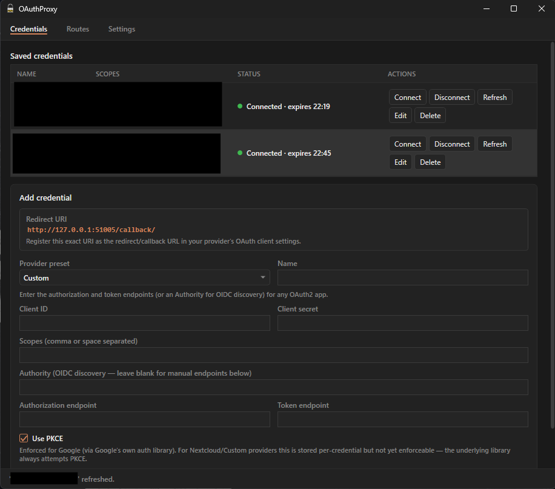
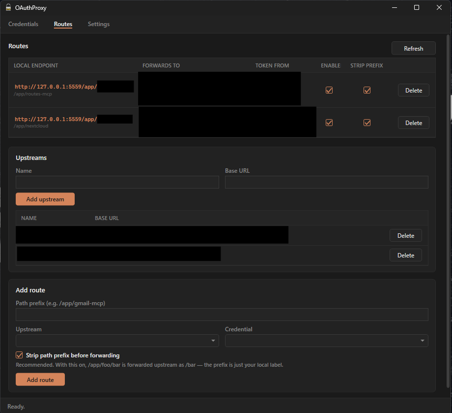
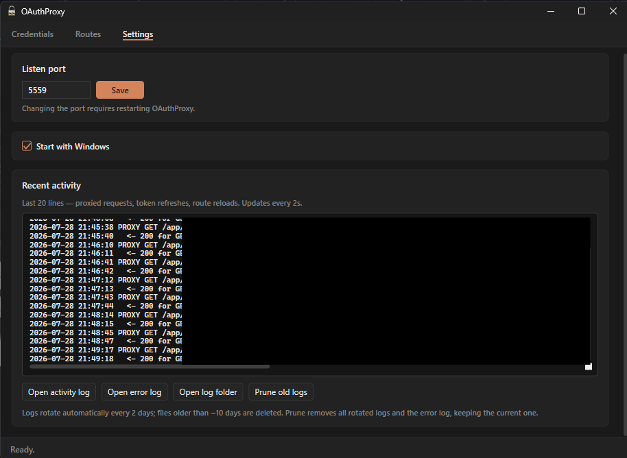

# OAuthProxy

An always-on Windows tray app that acts as a local OAuth2 reverse proxy for MCP and REST
endpoints. It exposes routes under `http://127.0.0.1:<port>/app/...`, injects a bearer token
per route, and refreshes tokens automatically before they expire — so tools like an MCP
client can talk to an OAuth-protected API without handling auth themselves.

## Screenshots

| Credentials | Routes | Settings |
|---|---|---|
| [](media/credentialsScreen.png) | [](media/routesScreen.png) | [](media/settingsScreen.png) |

*(Credential/upstream names blacked out — that's redaction, not a UI bug.)*

## Why

MCP servers and REST APIs are often behind OAuth2, but most MCP clients expect a bare HTTP
endpoint. OAuthProxy sits in between: it owns the OAuth flow and token lifecycle, and forwards
already-authenticated requests to whatever's actually behind the route.

## Features

- **Tray-resident**, starts hidden, no window shown until you open it from the tray icon
- **Multiple credentials, upstreams, and routes** — any credential can back any route; not a
  fixed 1:1 mapping
- **Multi-provider OAuth2**:
  - **Google** — via Google's own official library (`Google.Apis.Auth`), fixed loopback
    redirect port so it can be registered in Google Cloud Console if needed
  - **Nextcloud / any custom OAuth2 provider** — via `IdentityModel.OidcClient`, works with
    plain OAuth2 (no OIDC discovery, no `userinfo` endpoint required)
- **Full credential lifecycle** — Connect, Refresh, Disconnect (clears the local token
  without revoking the grant at the provider), Edit, Delete
- **Tokens auto-refresh** 10 minutes before expiry, in the background
- **Live status per credential** — a colored dot plus expiry time, refreshed every 15s
- **DPAPI-encrypted** credential store — nothing is ever written in plaintext
- **Activity log** with 2-day rotation, viewable from the Settings tab (every proxied
  request, token refresh, and route reload is logged)
- **Single-instance guard** — a second launch refuses to start rather than fighting the first
  over ports
- Survives provider/network errors without crashing — this is meant to run unattended
- **CI**: pushing a version tag runs the test suite, and only on success builds and publishes
  a downloadable release — see [Releases](#releases)

## Requirements

- Windows 10/11
- [.NET 8 SDK](https://dotnet.microsoft.com/download/dotnet/8.0) or newer (built against
  `net8.0-windows`; a `net9`/`net10` SDK can build it too — no need for an exact match)

## Quick start

```
clean-build.bat
```

Stops any running instance, wipes `bin`/`obj`, rebuilds, and launches the app. Look for the
padlock icon in the system tray — left-click opens the settings window, right-click gives a
menu (Open Settings / Start with Windows / Exit).

The app listens on **`http://127.0.0.1:5559`** by default (changeable in Settings; requires a
restart to take effect).

## Releases

Prebuilt, self-contained `OAuthProxy.exe` — no .NET install needed — is published on the
[Releases page](../../releases) whenever a version tag (`v*`) is pushed. `.github/workflows/release.yml`
runs the test suite first and only builds/publishes if it passes; nothing is released off a
failing build. Download the zip, extract, run `OAuthProxy.exe`.

## Setting up a credential

Credentials tab → pick a provider preset → fill in Client ID/Secret and scopes → **Add
credential** → **Connect** (opens your browser for the consent screen).

### Google

1. In [Google Cloud Console](https://console.cloud.google.com/), create an OAuth client.
   - **Desktop app** type is recommended — Google accepts any loopback port automatically,
     nothing to register.
   - If you use **Web application** type instead, you must add the exact redirect URI shown
     in the Credentials tab (`http://127.0.0.1:51004/authorize/`) to the client's allowed
     redirect URIs.
2. Paste the Client ID/Secret, set your scopes, Connect.

Every Google authorization forces the consent screen (`prompt=consent`) so a refresh token
is issued every time, not just on first-ever consent — otherwise the credential silently
can't auto-refresh later.

### Nextcloud / custom OAuth2

1. Create an OAuth2 client under **Nextcloud Settings → Security → OAuth2** (or your
   provider's equivalent).
2. Pick the **Nextcloud** or **Custom** preset, fill in the Authorization/Token endpoints
   (or an Authority for OIDC discovery), Client ID/Secret, scopes.
3. Register `http://127.0.0.1:51005/callback/` as the redirect URI if your provider requires
   pre-registration (it's shown in the UI, fixed and copyable).

## Setting up a route

Routes tab → add an **Upstream** (a name + base URL, e.g. your MCP server or API) → fill in
a **path prefix** (e.g. `/app/my-service`), pick the upstream and credential → **Add route**.

- **Strip prefix** (recommended, on by default): `/app/my-service/foo` is forwarded upstream
  as `/foo` — the prefix is just a local label. Turn it off only if the upstream genuinely
  expects that prefix in its own path.
- The full local endpoint (e.g. `http://127.0.0.1:5559/app/my-service`) is shown ready to
  paste into an MCP client config.
- A route can be turned off (**ENABLED** checkbox) without deleting it.
- Path prefixes must be unique — two routes can't share one; the UI rejects the duplicate up
  front rather than letting every request to it fail at runtime.

## Project layout

```
src/OAuthProxy.Core/     OAuth flows, encrypted storage, YARP proxy config, activity log
                          — no WPF dependency, just the engine
src/OAuthProxy.App/      WPF tray app: hosts Kestrel+YARP in-process, tray icon, UI
tests/OAuthProxy.Core.Tests/   xunit tests for the Core project
```

`OAuthProxy.App` owns the process: it starts a Kestrel/YARP host on a background thread pool
task (not the WPF dispatcher thread — avoids a sync-over-async deadlock), maps the reverse
proxy, then initializes the tray icon. The proxy and the UI share one DI container.

## Building

```
dotnet build OAuthProxy.slnx -m:1
```

`-m:1` (no parallel MSBuild) avoids an intermittent WPF markup-compile race on a freshly
cleaned `obj/` that otherwise produces spurious `CS2001`/`MC1000` errors. `clean-build.bat`
already retries once if the first pass fails, for the same reason.

### Publishing a standalone exe

```
dotnet publish src/OAuthProxy.App/OAuthProxy.App.csproj -p:PublishProfile=win-x64-selfcontained -c Release
```

Produces a single self-contained `OAuthProxy.exe` (~180 MB, .NET runtime bundled) at
`src/OAuthProxy.App/bin/Release/net8.0-windows/publish/win-x64/`. No .NET install required on
the target machine. See [THIRD-PARTY-NOTICES.md](THIRD-PARTY-NOTICES.md) before redistributing
it — it bundles third-party components whose licenses require their notices travel along.

### Tests

```
dotnet test tests/OAuthProxy.Core.Tests/OAuthProxy.Core.Tests.csproj
```

## Data & logs

Everything lives under `%AppData%\OAuthProxy\`:

| Path | Contents |
|---|---|
| `store.dat` | DPAPI-encrypted credentials, upstreams, routes, settings |
| `logs\activity-YYYYMMDD.log` | Every proxied request/response, connect/refresh/disconnect, route reloads. Rotates every 2 days, auto-deletes after ~10 |
| `logs\errors.log` | Unhandled exceptions and provider errors, with full stack traces |

Settings tab has buttons to open either log, open the folder, or prune old logs. Activity
logs record request paths and query strings in plaintext — if an upstream ever passes a
secret as a query parameter, it will appear in the log. Tokens themselves are never logged.

## Autostart

Settings tab → **Start with Windows**. Writes an `HKCU\...\Run` registry entry pointing at
the current exe; never set automatically.

## License

MIT — see [LICENSE](LICENSE). Third-party dependencies (all MIT or Apache-2.0) are listed in
[THIRD-PARTY-NOTICES.md](THIRD-PARTY-NOTICES.md), which also covers what redistributing the
published exe requires.
